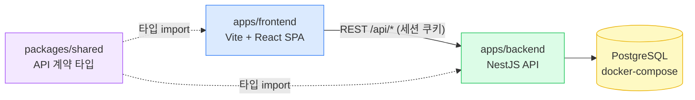

# Nosion 아키텍처

모노레포 구조, 백엔드 모듈 구성, REST API 계약, 데이터 모델을 정의한다. [PRD](./PRD.md)의 모든 기능(F1~F10)이 어느 모듈·테이블·엔드포인트로 구현되는지 이 문서로 추적 가능해야 한다. 스택 선택의 근거는 [tech-stack.md](./tech-stack.md)와 ADR을 본다.

## 1. 전체 구조

프론트엔드 SPA가 REST API로 백엔드와 통신하고, 백엔드가 PostgreSQL을 소유하는 단순한 2계층 구조다. 인증은 better-auth가 `/api/auth/*`에서 처리하고 세션 쿠키를 발급하며, 이후 모든 API 요청은 세션 가드를 통과한다.



- dev에서는 Vite 프록시(`/api` → `:3001`)로 동일 오리진을 유지해 쿠키 문제를 회피한다.
- `packages/shared`의 요청/응답 타입이 계약의 단일 원천이다.

## 2. 백엔드 모듈 구성 (NestJS)

| 모듈 | 책임 | 담당 PRD 기능 |
|------|------|--------------|
| `AuthModule` | better-auth 마운트(`/api/auth/*`), 세션 가드 제공, 가입 시 워크스페이스 자동 생성 훅 | F1 |
| `PagesModule` | 페이지 트리 CRUD·이동, 아이콘/커버, 즐겨찾기, 휴지통(소프트 삭제·복원·영구 삭제) | F2, F7, F8, F9 |
| `DocumentsModule` | 문서 본문(JSONB) 조회·저장, 저장 시 검색 텍스트 추출·갱신 | F3 |
| `DatabasesModule` | 속성 CRUD, 행 CRUD·값 편집, 뷰 CRUD(필터·정렬·보드 그룹) | F4, F5 |
| `SearchModule` | 제목+본문 pg_trgm 검색 | F6 |
| `DrizzleModule` | DB 커넥션·트랜잭션 프로바이더 (전역) | — |

- F10(다크모드)은 프론트 전용(localStorage)이라 백엔드 모듈이 없다.
- **워크스페이스 격리**(PRD §4): 세션 가드가 요청에 사용자의 워크스페이스를 주입하고, 모든 쿼리는 `workspace_id` 조건을 강제한다. 별도 WorkspaceModule 없이 가드 계층에서 처리한다(1인 1워크스페이스 고정).

## 3. 데이터 모델

핵심 설계: **행(row)도 페이지다**(용어집 — "행을 열어 보면 그 자체가 문서 페이지"). 행은 `parent_id`가 데이터베이스 페이지인 페이지로 저장하되, 사이드바 트리에는 노출하지 않고 뷰를 통해 접근한다. 문서 본문은 페이지당 BlockNote JSON 하나를 JSONB로 통저장한다(ADR-0004).

```mermaid
erDiagram
    user ||--|| workspace : "1:1 소유"
    workspace ||--o{ page : "포함"
    page ||--o| page : "parent (트리)"
    page ||--o| document : "문서 본문"
    page ||--o{ db_property : "속성 (DB 페이지만)"
    page ||--o{ db_view : "뷰 (DB 페이지만)"
    page ||--o{ property_value : "값 (행 페이지만)"
    db_property ||--o{ property_value : "정의"

    user {
        text id PK "better-auth 관리"
    }
    workspace {
        uuid id PK
        text user_id FK "UNIQUE"
        text name
    }
    page {
        uuid id PK
        uuid workspace_id FK
        uuid parent_id FK "NULL=최상위"
        text type "document | database"
        text title
        text icon "이모지, NULL 가능"
        text cover "프리셋 키, NULL 가능"
        boolean is_row "DB 행 여부(트리 비노출)"
        boolean is_favorite
        integer position "형제 간 순서"
        timestamptz deleted_at "NULL=활성, 값=휴지통"
    }
    document {
        uuid page_id PK_FK
        jsonb content "BlockNote 블록 배열"
        text search_text "본문 평문 (pg_trgm GIN)"
    }
    db_property {
        uuid id PK
        uuid page_id FK "데이터베이스 페이지"
        text name
        text type "text|number|select|multi_select|date|checkbox"
        jsonb config "셀렉트 옵션 등"
        integer position
    }
    property_value {
        uuid row_page_id PK_FK
        uuid property_id PK_FK
        jsonb value
    }
    db_view {
        uuid id PK
        uuid page_id FK "데이터베이스 페이지"
        text name
        text type "table | board | list"
        jsonb config "filter, sort, 보드 group_property_id"
        integer position
    }
```

설계 노트:

- **트리**: `parent_id` + `position`(정수, 이동 시 형제 재배열). 무한 중첩은 재귀 CTE로 조회.
- **휴지통**: `deleted_at` 소프트 삭제. 삭제 시 하위 트리 전체에 전파, 복원 시 부모가 삭제 상태면 최상위로 복원(PRD F7). 영구 삭제는 행 실제 삭제(문서·값·뷰는 FK cascade).
- **better-auth 테이블**(user/session/account/verification)은 better-auth 스키마 그대로 두고, 애플리케이션 테이블은 `user.id`만 참조한다.
- **검색**: `page.title`과 `document.search_text` 양쪽에 `pg_trgm` GIN 인덱스. `document` 저장 트랜잭션 안에서 `search_text`를 함께 갱신해 "저장 직후 검색됨"(PRD F6)을 보장한다.
- **행의 속성 값**: EAV(`property_value`)로 저장, 값은 타입별 JSONB(`{"text": "..."}`, `{"number": 3}`, `{"select": "opt-id"}` 등 — 상세 스키마는 `packages/shared`에 타입으로 정의).

## 4. REST API 계약

경로는 모두 `/api` 아래, 인증은 세션 쿠키, 본문은 JSON. 요청/응답 타입은 `packages/shared`가 원천이다.

| 영역 | 엔드포인트 | 설명 | PRD |
|------|-----------|------|-----|
| 인증 | `POST/GET /api/auth/*` | better-auth 위임 (가입·로그인·로그아웃·세션) | F1 |
| 페이지 | `GET /api/pages/tree` | 활성 페이지 트리(행 제외) + 즐겨찾기 목록 | F2, F8 |
| | `POST /api/pages` | 생성 `{type, parentId?}` | F2 |
| | `GET /api/pages/:id` | 단건(제목·아이콘·커버·즐겨찾기·타입) | F2, F9 |
| | `PATCH /api/pages/:id` | 제목·아이콘·커버·즐겨찾기 수정 | F2, F8, F9 |
| | `POST /api/pages/:id/move` | `{parentId, position}` 이동 | F2 |
| | `DELETE /api/pages/:id` | 휴지통 이동(하위 포함) | F7 |
| 휴지통 | `GET /api/trash` | 휴지통 목록 | F7 |
| | `POST /api/pages/:id/restore` | 복원 | F7 |
| | `DELETE /api/pages/:id/permanent` | 영구 삭제 | F7 |
| 문서 | `GET /api/pages/:id/content` | BlockNote JSON | F3 |
| | `PUT /api/pages/:id/content` | 본문 저장(+검색 텍스트 갱신) | F3, F6 |
| 데이터베이스 | `GET /api/databases/:pageId` | 속성·뷰·행(값 포함) 일괄 조회 | F4, F5 |
| | `POST/PATCH/DELETE /api/databases/:pageId/properties(/:id)` | 속성 CRUD | F4 |
| | `POST /api/databases/:pageId/rows` | 행 생성(페이지 생성 포함) | F4 |
| | `PATCH /api/rows/:pageId/values/:propertyId` | 값 편집 | F4, F5 |
| | `POST/PATCH/DELETE /api/databases/:pageId/views(/:id)` | 뷰 CRUD(필터·정렬·그룹 config 포함) | F5 |
| 검색 | `GET /api/search?q=` | 제목+본문 매칭 페이지 목록 | F6 |

- 행 삭제/복원은 페이지와 동일 엔드포인트를 쓴다(행=페이지).
- 필터·정렬은 서버가 아닌 뷰 config 저장 + 조회 시 서버 적용으로 시작한다(행 수가 작을 때는 클라이언트 적용도 허용 — 구현 시 결정, 계약은 config 저장이 기준).

## 5. 프론트엔드 구조

```
apps/frontend/src/
├── api/          # shared 타입 기반 API 클라이언트 + TanStack Query 훅
├── routes/       # React Router 라우트 (login, app, page/:id, trash, search)
├── components/
│   ├── sidebar/  # 트리, 즐겨찾기 섹션, 검색 진입
│   ├── editor/   # BlockNote 래퍼, 자동 저장(디바운스)
│   ├── database/ # 테이블/보드/리스트 뷰, 속성·필터·정렬 UI
│   └── page/     # 제목·아이콘·커버 헤더
└── theme/        # 다크모드 토글 + localStorage
```

주요 화면 흐름:

```
로그인(F1) → 앱 셸(사이드바 F2/F8 + 본문)
                ├─ 문서 페이지 → 에디터(F3), 헤더(F9)
                ├─ 데이터베이스 페이지 → 뷰 전환(F5) → 행 열기 → 행 페이지(F4)
                ├─ 검색(F6) → 페이지 이동
                └─ 휴지통(F7)
```

## 6. 기능 → 구현 추적 요약

| PRD | 백엔드 | 테이블 | 프론트 |
|-----|--------|--------|--------|
| F1 인증 | AuthModule | user/session (better-auth), workspace | routes/login |
| F2 트리 | PagesModule | page | sidebar |
| F3 문서 편집 | DocumentsModule | document | editor |
| F4 데이터베이스 | DatabasesModule | db_property, property_value, page(is_row) | database |
| F5 뷰 3종 | DatabasesModule | db_view | database |
| F6 검색 | SearchModule | page.title, document.search_text | sidebar/검색 |
| F7 휴지통 | PagesModule | page.deleted_at | routes/trash |
| F8 즐겨찾기 | PagesModule | page.is_favorite | sidebar |
| F9 아이콘/커버 | PagesModule | page.icon, page.cover | page 헤더 |
| F10 다크모드 | (없음) | (없음) | theme |
